# Perceptron Simulation

This project is a visualization of the learning algorithm for a single perceptron neuron. It provides an interactive interface to understand how a perceptron learns and makes decisions based on input data. The project is built using React with TypeScript and Chakra UI. Additionally, it utilizes Conva.js for canvas drawing, React Router for navigation, and Framer Motion for animations.

## Features

- Visual representation of a single perceptron neuron learning algorithm
- Adjustable learning rate and activation function
- Real-time visualization of weight updates
- Graph displaying the training errors and test accuracy over iterations

## Usage

- Select an example dataset or upload your own from a file (an example of what the data file should look like is given on the start page)
- Adjust the learning rate, activation function and divide file into training and testing sets using the provided input fields
- Click one of the "Train" buttons to initiate the learning process
- The current weights of the perceptron are shown on the screen

## Screenshots

### Desktop

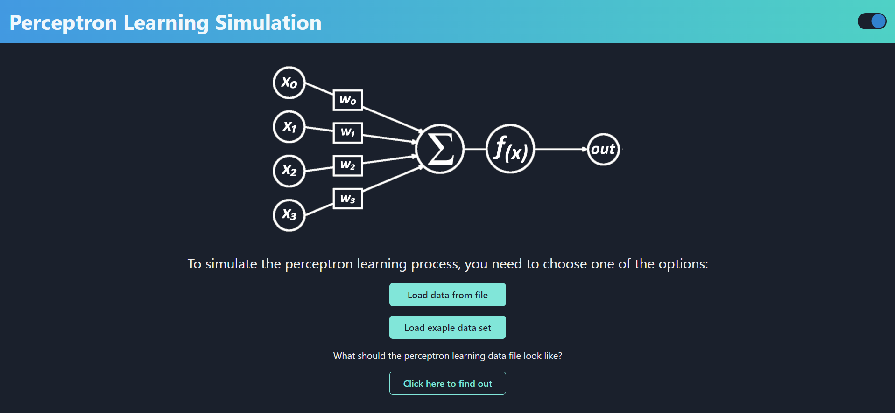
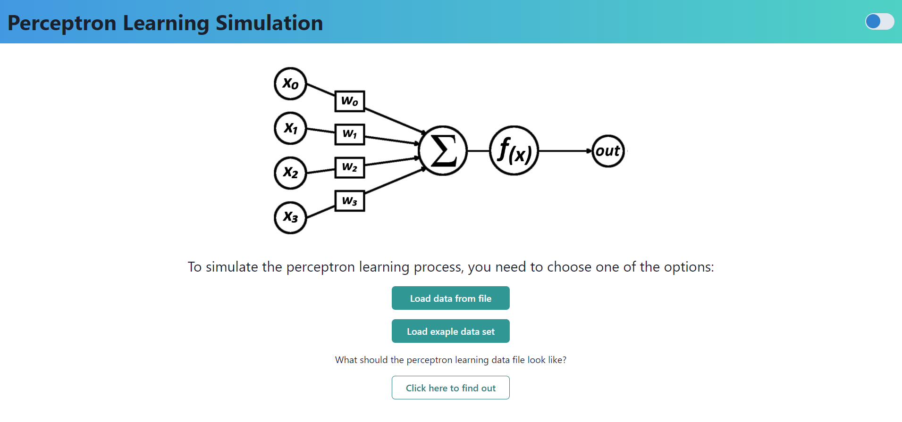

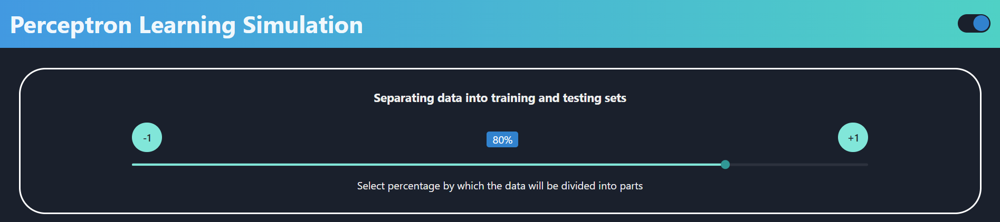
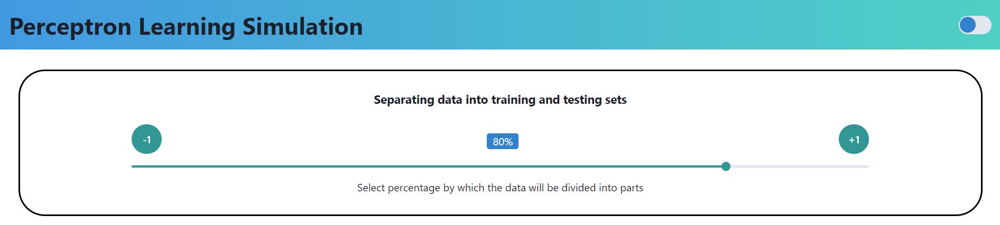

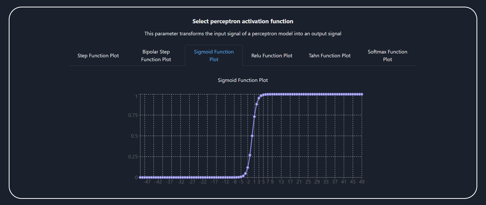
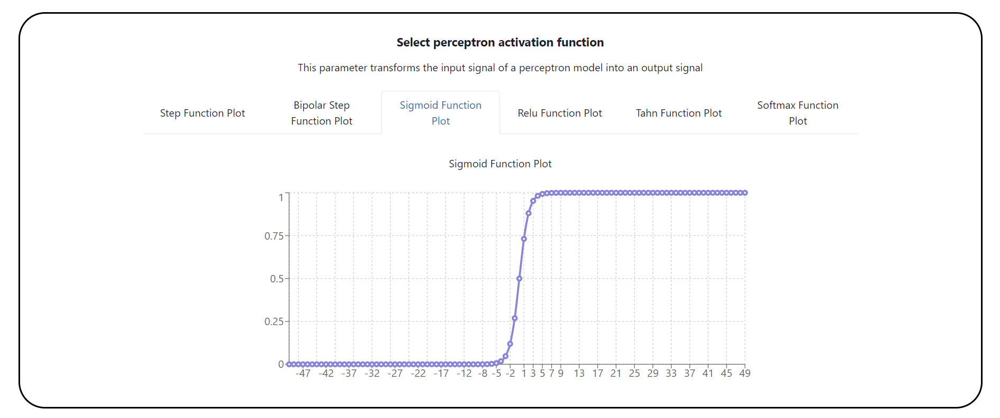

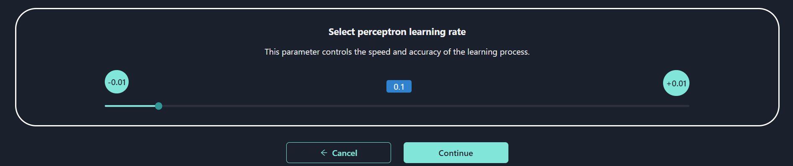
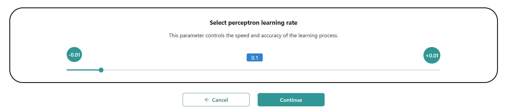

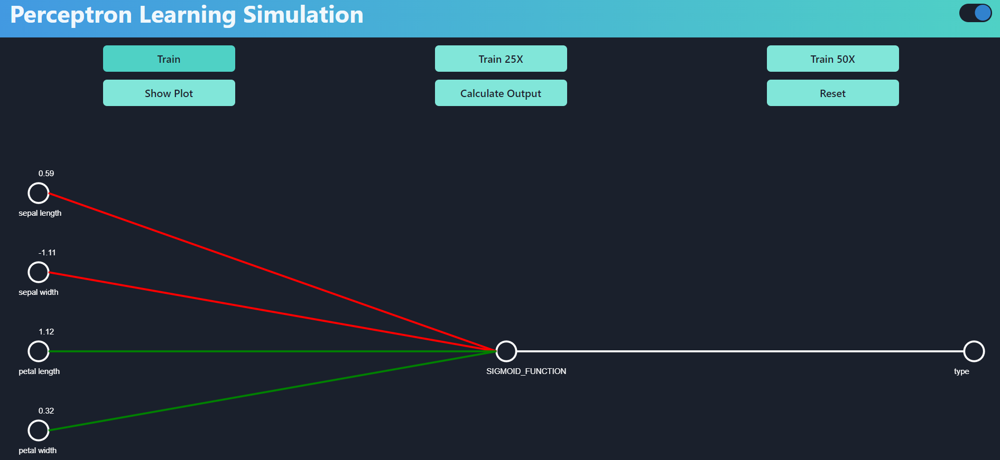
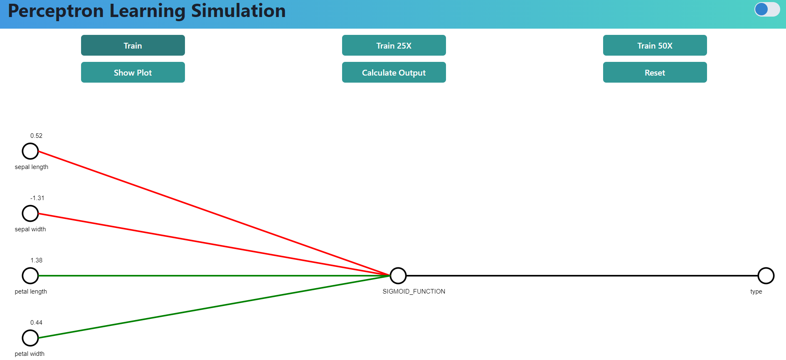

### Mobile

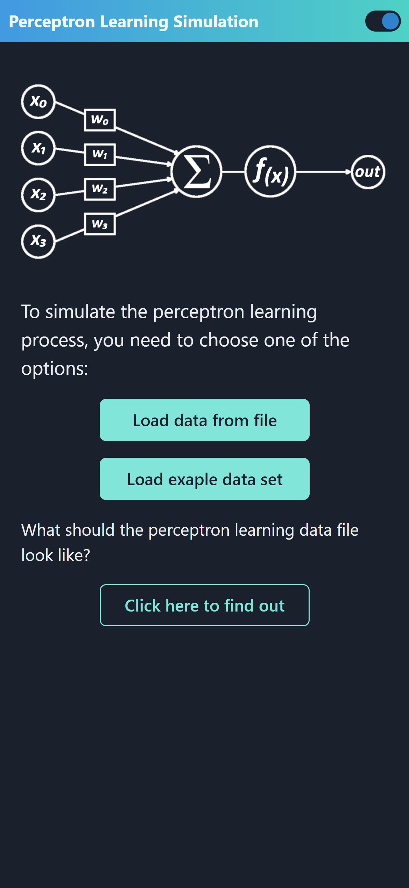
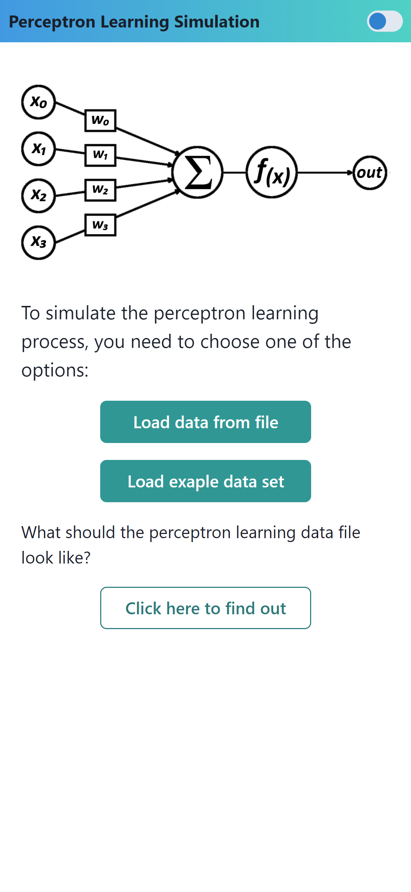
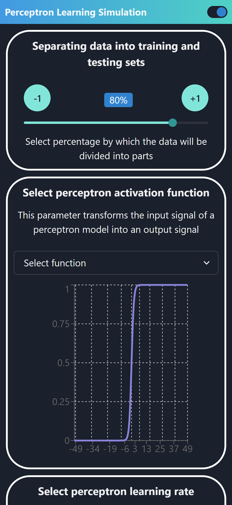
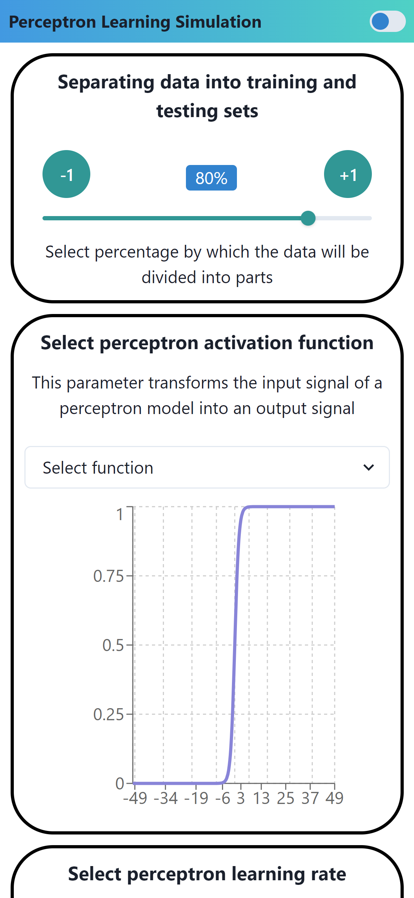

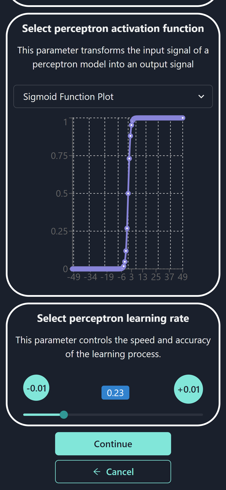
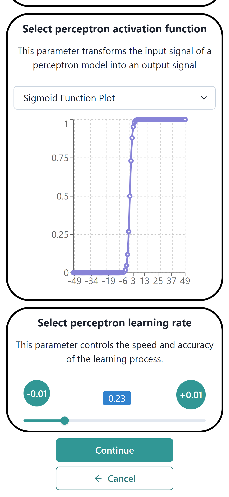
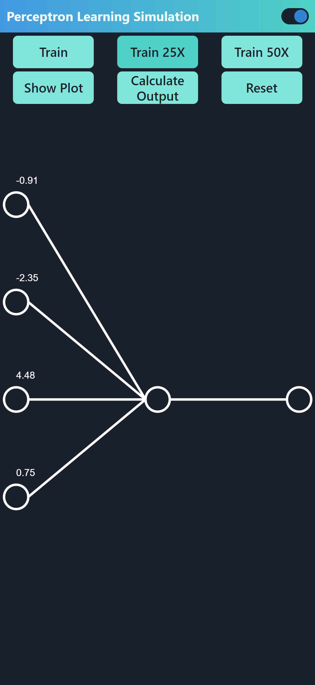
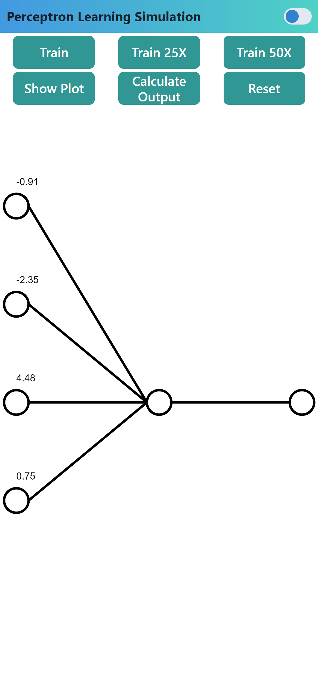

